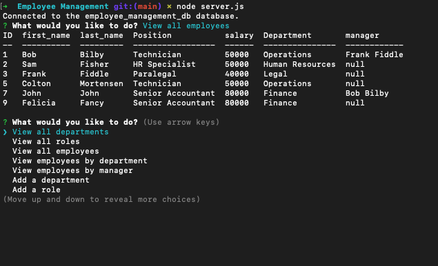

# Employee Management CLI
---

A simple CLI to manage employees and the structure of a company

## Description

This database driven management cli works by storing employee info and the company departments, managers, roles, and salaries. The simple CLI will walk you through the many options and allow a user to keep track of who works where and is managed by who.

## Usage and Installation

At this time, the repo will have to be cloned to your local machine then run using node.
After installing and running the CLI simply follow the prompts to update the things you need to.

## ScreenShot

## Questions
### If you have any questions or comments, feel free to email me and I will get back to you soon!

- [Coltmort](https://github.com/coltmort)
- colton.j.mortensen@gmail.com

## Links

[github](https://github.com/coltmort/Employee-Management)

[Demo](https://drive.google.com/file/d/1i6HifPs6ZQOskJkrWWFpi5rO1gNfp2BX/view?usp=share_link)